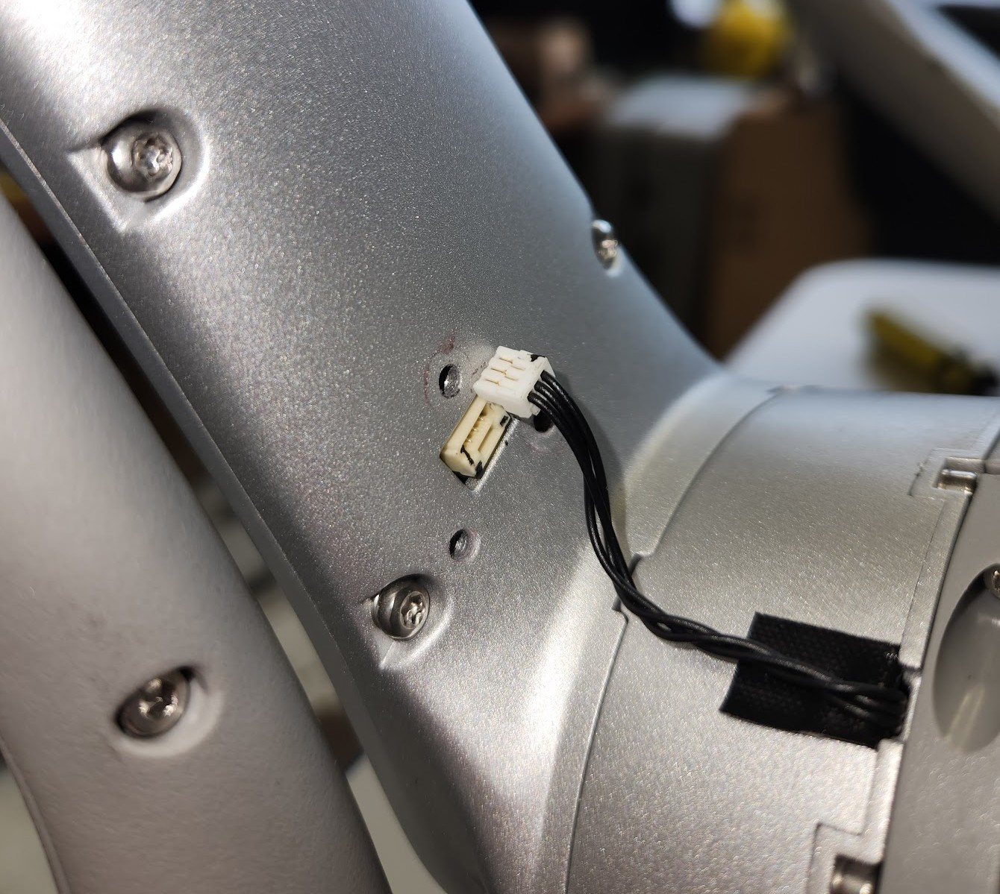
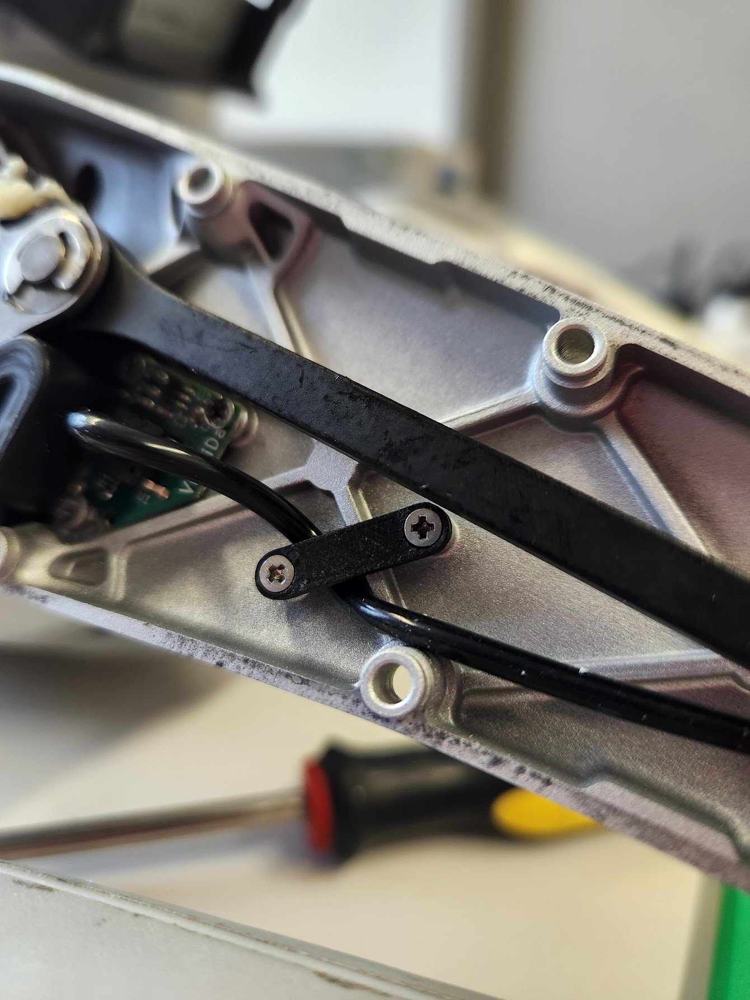
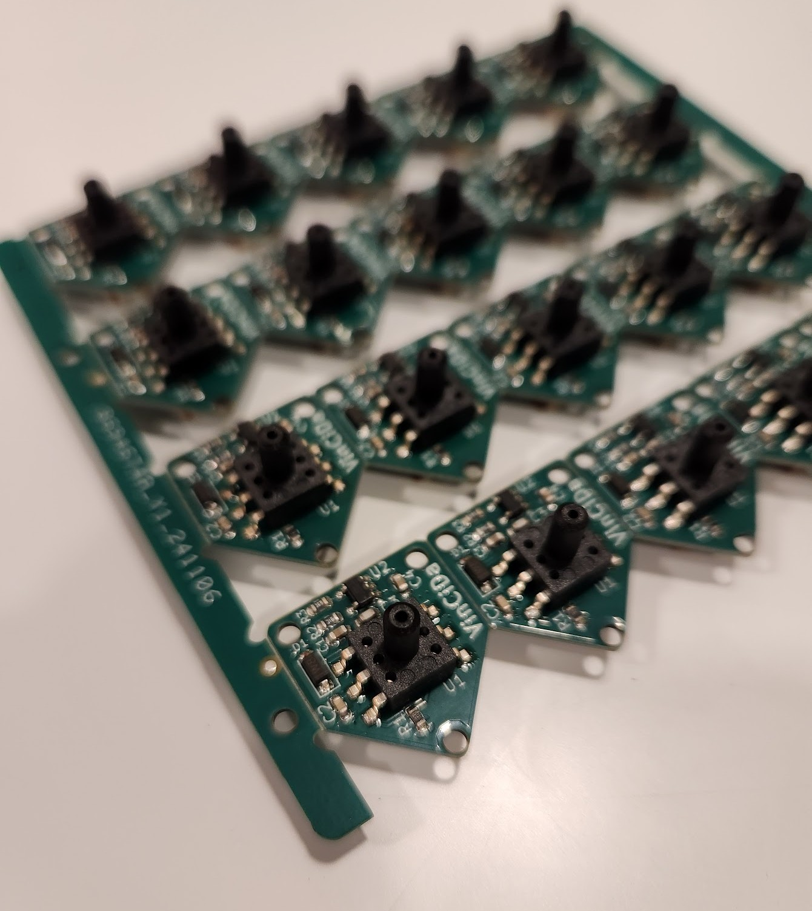
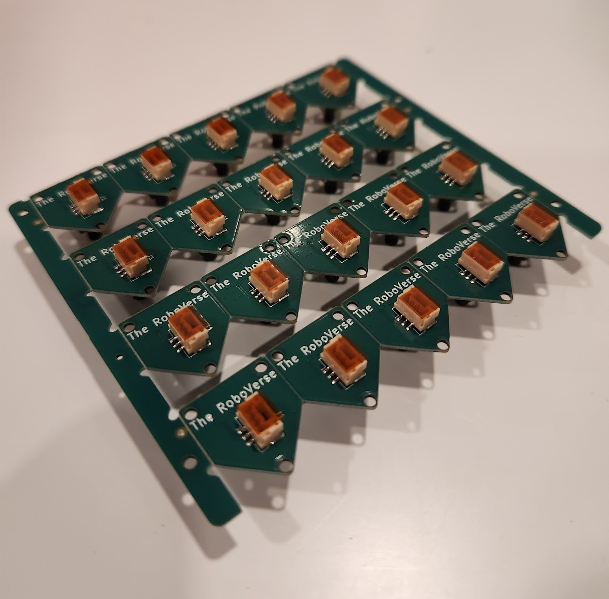

The pressure sensor used is the GZP6859A040KPP33Z, as a replacement for the original XGZP6869A040 (Both have a pressure range between 0-40KPa).

The tube on the GO2 EDU is 1mm ID and 3mm OD silicone tubing, but I could make it fit on the pressure sensors, so I used 1.5mm ID instead. A small piece of tape or heat shrink can be used ont the foot side to make it fit better.

The screws needed are M2 length 4mm countersunk screws, the original being Philips head. 7 screws are needed per leg, for a total of 28 screws. They fix the tubing using two small plastic brackets than can be 3D printed, the files are in the `3d_models` folder (4 of each must be printed).

By removing a plastic cover on the inner part of the leg, a connector is revealed, which connects to the sensor once it has been fastened : 

One of the 3D printed brackets, fastened, holding the tube in place:

Here is the final PCBs manufactured and assembled:

